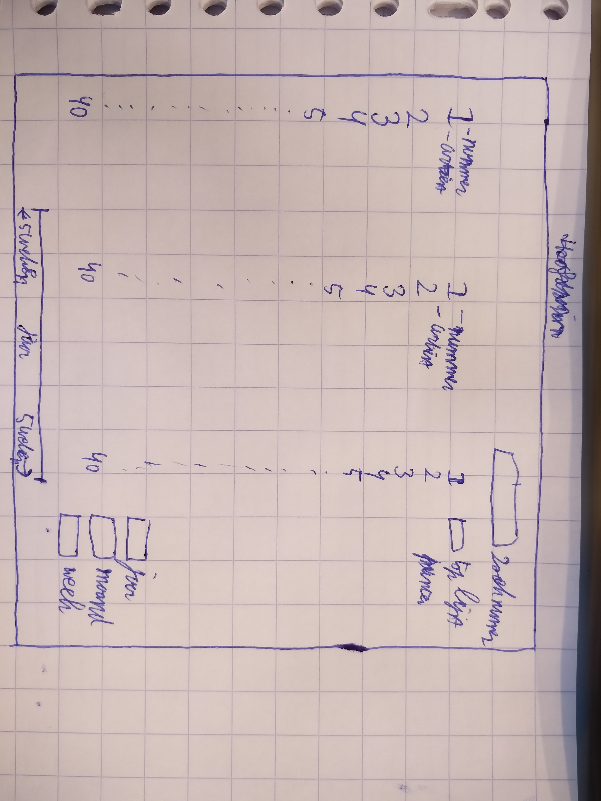
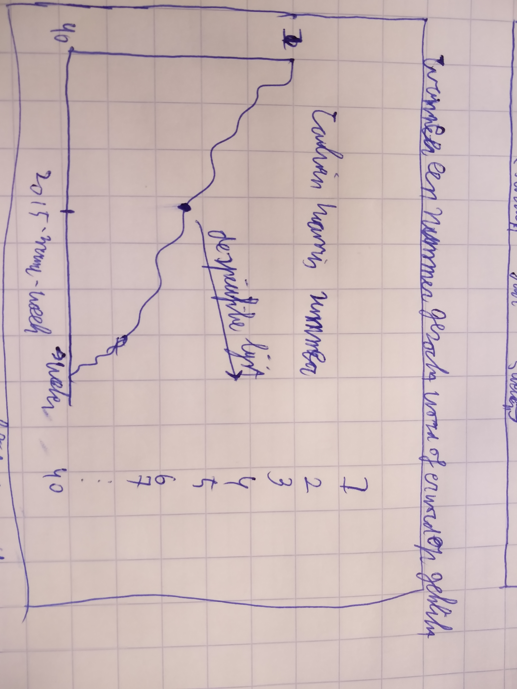
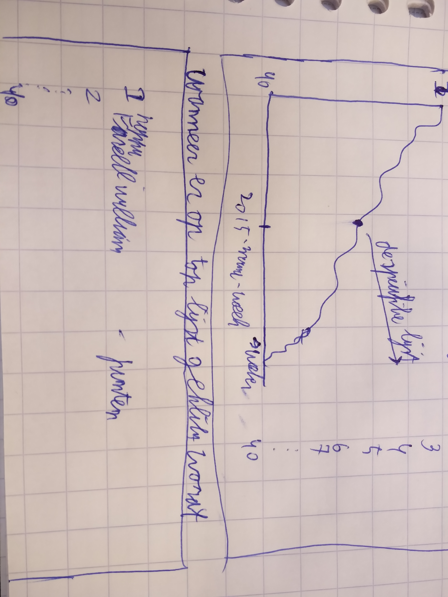

# Muziek project top 40
Daan van der Thiel
500694621

## top 40 lijst
zie [top 40]
(http://www.top40.nl/)

 Deze site geeft de muziek top 40 weer vanaf 1965-nu. Doordat deze site de data goed geordend heeft kan dit makkelijk van de site gehaald worden en kan ik hier een visualisatie van maken.

## doel van de visualisatie
Het doel van mijn visualisatie is het duidelijk weergeven van de top 40 data over verschillende periodes en het duidelijk weergeven van het verloop van een nummer van 1965-heden. Dit wil ik visualiseren op de volgende manier:

Het zal 3 lijsten met top 40 hits weergeven waarbij veranderingen met een kleur weergeven worden. Verder zal de simulatie de nummers die veranderen duidelijk laten zien. Je kan door rechtsonder een jaar een maand en eventueel een week in te vullen een periode selecteren en over die periode 5 weken vooruit en 5 weken achteruit gaan over de lijst. Dit geeft zo een redelijk overzicht van de nummers. De verandering kan zo goed gevolgd worden.

----
## wanneer een nummer geselecteerd word
Als een nummer geselecteerd wordt door zowel het klikken op een nummer in de lijst als een nummer opzoeken in de selectie rechtsboven. zal de volgende pagina weergeven worden:

Deze pagina geeft een lijngrafiek met het verloop van het nummer van het begin in de lijst totdat deze uit de lijst verdwijnt. Ook kan je hier momenten selecteren en zo de top 40 van die specifieke week bekijken.

## lijst met nummers hoogste punten 
Als er in de hoofdpagina top lijst aangedrukt word zal er de volgende pagina geopend worden:

Deze pagina geeft de nummers met het hoogst aantal punten. Dit is een combinatie van het hoogst aantal punten en het langst in de top 40. 
